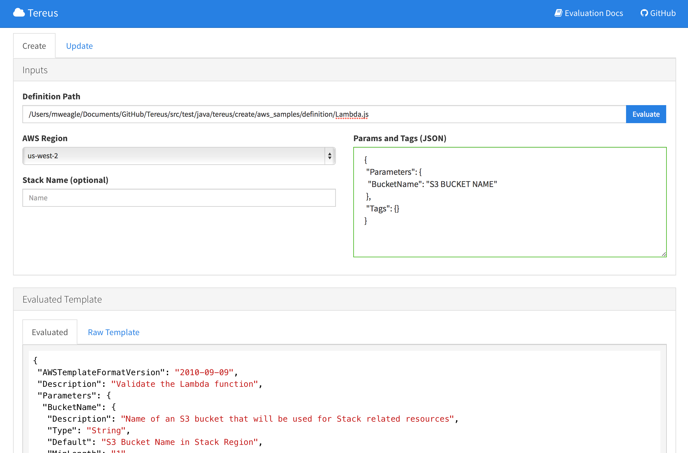

<a href="https://travis-ci.org/mweagle/Tereus"></a>

# TL;DR

Use JS functions to define and compose CloudFormation Templates.

Extras:

  - External scripts can be automatically scanned & transformed into `Fn::Join` representations (via `Embed.File("init.sh")`).  For example, see this [definition](https://github.com/mweagle/Tereus/blob/master/src/test/java/tereus/create/embedding/definition/inlineAWS.js#L4).
  - Focus on [CloudFormation::Init](http://docs.aws.amazon.com/AWSCloudFormation/latest/UserGuide/aws-resource-init.html) JSON [externalized](https://github.com/mweagle/Tereus/blob/master/src/test/java/tereus/create/cfn-init/definition/default.js#L8) with automatic [plumbing](https://github.com/mweagle/Tereus/blob/master/src/test/java/tereus/create/cfn-init/expected/default.json#L45) included.
  - DRY [enumeration](https://github.com/mweagle/Tereus/blob/master/src/main/resources/bindings/create/CONSTANTS.js#L178) of latest Amazon Linux AMIs (optional).
  - Special affordances for [AWS Lambda](https://aws.amazon.com/lambda/) based services.  See the [Lambda example](https://github.com/mweagle/Tereus/tree/master/examples/lambda) for an example.

# Overview

Tereus simplifies defining, composing, and creating AWS
[CloudFormation](http://aws.amazon.com/cloudformation/) templates.  Template
definitions can start as simple JavaScript object definitions (raw JSON
(eg: [samples](http://docs.aws.amazon.com/AWSCloudFormation/latest/UserGuide/CHAP_TemplateQuickRef.html))) and
gradually encapsulated & extended using built-in and user-defined JavaScript functions.

# Example

```
/* global CloudFormationTemplate,EC2 */
CloudFormationTemplate("EC2Instance")({
  "AWSTemplateFormatVersion": "2010-09-09",
  "Description": "Validate the EC2 helper object",
  "Resources" :
  {
    "MyEC2Instance" : AWS.EC2.Instance({
        "Metadata": {
          "Builder":"Created"
        }
      })
  }
});
```

# Evaluation Context

The default evaluation context includes:
  - default AWS resource wrappers (EC2, Lambda, etc)
  - Affordances for specific resource types.  For instance, `Lambda` resources can be automatically _npm install_'d, ZIP'd, and uploaded to S3 as part of stack operations.
  - `load()` support to include your own set of JS functions
  - Access to the AWS credentials & region to directly invoke APIs through the Java SDK

More information on the evaluation context is available via:

  1. java -jar Tereus.jar gui
  1. open http://localhost:4567/docs/index.html

or via the [evaluation README](https://github.com/mweagle/Tereus/tree/master/src/main/resources/bindings).

# Usage

Tereus supports two modes of operation:

  - Command Line
  - Web Interface

## Command Line

The command line interface is appropriate as part of a larger automated build.  The command line is also the _only_ way to actually provision a CloudFormation stack following a successful evaluation.

Additional documentation is available via `java -jar Tereus.jar help create`.  Sample CLI output below:

```
java -jar ./build/libs/Tereus.jar help create
NAME
        Tereus create - Create a CloudFormation stack

SYNOPSIS
        Tereus [-v] create
                [(-a <jsonParamAndTagsPath> | --arguments <jsonParamAndTagsPath>)]
                [(-b <s3BucketName> | --bucket <s3BucketName>)] [(-d | --dry-run)]
                [(-h | --help)] [(-o <outputFilePath> | --output <outputFilePath>)]
                [(-r <region> | --region <region>)]
                [(-s <stackName> | --stack <stackName>)]
                (-t <stackTemplatePath> | --template <stackTemplatePath>)

OPTIONS
        -a <jsonParamAndTagsPath>, --arguments <jsonParamAndTagsPath>
            Path to JSON file including "Parameters" & "Tags" values

        -b <s3BucketName>, --bucket <s3BucketName>
            S3 Bucketname to host stack resources. MUST be CLI option OR
            `Parameters.BucketName` value in JSON input

        -d, --dry-run
            Dry run - stack operation will NOT be applied (default=false)

        -h, --help
            Display help information

        -o <outputFilePath>, --output <outputFilePath>
            Optional file to which evaluated template will be saved

        -r <region>, --region <region>
            AWS Region (default=us-east-1)

        -s <stackName>, --stack <stackName>
            Optional Stack Name to use. If empty,
            {basename+SHA256(templateData)} will be provided

        -t <stackTemplatePath>, --template <stackTemplatePath>
            Path to CloudFormation definition [REQUIRED]

        -v
            Verbose mode
```

## Web Interface

Tereus also supports a Web-based UI to support interactive usage.
The UI is available by providing the `gui` command line option as in:

```
$ java -jar ./build/libs/Tereus.jar gui
[Thread-0] INFO spark.webserver.SparkServer - == Spark has ignited ...
[Thread-0] INFO spark.webserver.SparkServer - >> Listening on 0.0.0.0:4567
[Thread-0] INFO org.eclipse.jetty.server.Server - jetty-9.0.z-SNAPSHOT
[Thread-0] INFO org.eclipse.jetty.server.ServerConnector - Started ServerConnector@21f015bc{HTTP/1.1}{0.0.0.0:4567}
15:37:38.264 [main] INFO  com.mweagle.Tereus - Tereus UI available at http://localhost:4567/
```
And visiting [http://localhost:4567/](http://localhost:4567/).  (The port can be overriden using the `-p/--port` CLI option.)



The UI is served by [Spark](http://sparkjava.com/) and the client is backed by [ReactJS](http://facebook.github.io/react/) and [Flux](https://github.com/facebook/flux).

The navigation bar also includes an *Evaluation Docs* link which describes what
libraries, convenience methods, and global namespace are available to simplify
CloudFormation composition.

# Building Tereus

To build Tereus, ensure you have the following included in your _PATH_ varaible:

- Java 1.8

    ```
    $java -version
    java version "1.8.0_51"
    Java(TM) SE Runtime Environment (build 1.8.0_51-b16)
    Java HotSpot(TM) 64-Bit Server VM (build 25.51-b03, mixed mode)
    ```
- [Gradle](https://gradle.org/) 2.5 or higher

    ```
    gradle --version

    ------------------------------------------------------------
    Gradle 2.5
    ------------------------------------------------------------

    Build time:   2015-07-08 07:38:37 UTC
    Build number: none
    Revision:     093765bccd3ee722ed5310583e5ed140688a8c2b

    Groovy:       2.3.10
    Ant:          Apache Ant(TM) version 1.9.3 compiled on December 23 2013
    JVM:          1.8.0_51 (Oracle Corporation 25.51-b03)
    OS:           Mac OS X 10.10.5 x86_64
    ```

- [Node.js](https://nodejs.org/download/) 0.12.* or higher

    ```
    $ node --version
    v0.12.7
    ```

And run:

```
gradle build

```

This will generate an uber jar _build/libs/Tereus.jar_ which includes
all necessary runtime dependencies.


# Upcoming

    * JVM-based Lambda support
    * Transactionally addressing multiple geographies
